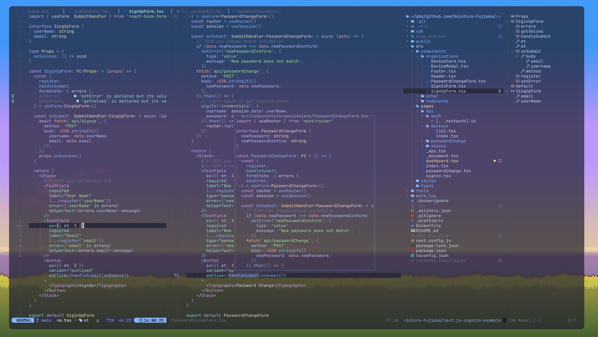

# Dotfiles
This dotfiles is based on [craftzdog/dotfiles-public](https://github.com/craftzdog/dotfiles-public).

Thank you for sharing the great dotfiles!!🌈

## Screen Shot

## Applications
- [fish-shell/fish-shell](https://github.com/fish-shell/fish-shell) - the friendly interactive shell
- [jorgebucaran/fisher](https://github.com/jorgebucaran/fisher) - A plugin manager for Fish
  - [jethrokuan/z](https://github.com/jethrokuan/z) - a port of [z](https://github.com/rupa/z) for the fish shel
- [neovim/neovim](https://github.com/neovim/neovim) - a project that seeks to aggressively refactor Vim 
- [tmux/tmux](https://github.com/tmux/tmux) - a terminal multiplexer
- [x-motemen/ghq](https://github.com/x-motemen/ghq) - manage remote repository clones
- [dandavison/git-delta](https://github.com/dandavison/delta) - a git diff tools
- [jesseduffield/lazygit](https://github.com/jesseduffield/lazygit) - a simple terminal UI for git commands
- [tree-sitter/tree-sitter](https://github.com/tree-sitter/tree-sitter) - a parser generator tool and an incremental parsing library
- [peco/peco](https://github.com/peco/peco) - simplistic interactive filtering tool
- [mattn/memo](https://github.com/mattn/memo) - memo life for you

## Neovim plugins
- [wbthomason/packer.nvim](https://github.com/wbthomason/packer.nvim) - plugin/package management for Neovim
- [nvim-lualine/lualine.nvim](https://github.com/nvim-lualine/lualine.nvim) - a blazing fast and easy to configure Neovim statusline written in Lua
- [kdheepak/tabline.nvim](https://github.com/kdheepak/tabline.nvim) - a "buffer and tab" tabline
- [simeji/winresizer](https://github.com/simeji/winresizer) - very simple vim plugin for easy resizing of your vim windows
- [iamcco/markdown-preview.nvim](https://github.com/iamcco/markdown-preview.nvim) - preview markdown on your modern browser with synchronised scrolling and flexible configuration
- [nvim-lua/plenary.nvim](https://github.com/nvim-lua/plenary.nvim) - all the lua functions I don't want to write twice
- [onsails/lspkind-nvim](https://github.com/onsails/lspkind.nvim) - this tiny plugin adds vscode-like pictograms to neovim built-in lsp
- [hrsh7th/cmp-buffer](https://github.com/hrsh7th/cmp-buffer) - nvim-cmp source for buffer words
- [hrsh7th/cmp-nvim-lsp](https://github.com/hrsh7th/cmp-nvim-lsp) - nvim-cmp source for neovim's built-in language server client
- [hrsh7th/nvim-cmp](https://github.com/hrsh7th/nvim-cmp) - a completion engine plugin for neovim written in Lua
- [neovim/nvim-lspconfig](https://github.com/neovim/nvim-lspconfig) - configs for the Nvim LSP client 
- [jose-elias-alvarez/null-ls.nvim](https://github.com/jose-elias-alvarez/null-ls.nvim) - use Neovim as a language server to inject LSP diagnostics, code actions, and more via Lua
- [williamboman/mason.nvim](https://github.com/williamboman/mason.nvim) - a Neovim plugin that allows you to easily manage external editor tooling such as LSP servers, DAP servers, linters, and formatters through a single interface
- [williamboman/mason-lspconfig.nvim](https://github.com/williamboman/mason-lspconfig.nvim) - bridges mason.nvim with the lspconfig plugin - making it easier to use both plugins together 
- [glepnir/lspsaga.nvim](https://github.com/glepnir/lspsaga.nvim) - a lightweight LSP plugin based on Neovim's built-in LSP with a highly performant UI
- [L3MON4D3/LuaSnip](https://github.com/L3MON4D3/LuaSnip) - snippet Engine for Neovim written in Lua
- [nvim-treesitter/nvim-treesitter](https://github.com/nvim-treesitter/nvim-treesitter) - configurations and abstraction layer for Neovim
- [nvim-telescope/telescope.nvim](https://github.com/nvim-telescope/telescope.nvim) - a highly extendable fuzzy finder over lists
- [nvim-telescope/telescope-file-browser.nvim](https://github.com/nvim-telescope/telescope-file-browser.nvim)(not used) - a file browser extension for telescope.nvim
- [nvim-tree/nvim-tree.lua](https://github.com/nvim-tree/nvim-tree.lua) - A File Explorer For Neovim Written In Lua
- [windwp/nvim-autopairs](https://github.com/windwp/nvim-autopairs) - a super powerful autopair plugin for Neovim that supports multiple characters
- [windwp/nvim-ts-autotag](https://github.com/windwp/nvim-ts-autotag) - use treesitter to autoclose and autorename html tag
- [svrana/neosolarized.nvim](https://github.com/svrana/neosolarized.nvim) - a truecolor, solarized dark colorscheme using tjdevries/colorbuddy.vim for neovim
- [bluz71/vim-nightfly-colors](https://github.com/bluz71/vim-nightfly-colors) - nightfly is a dark midnight theme for classic Vim & modern Neovim
- [tjdevries/colorbuddy.nvim](https://github.com/tjdevries/colorbuddy.nvim) - a colorscheme helper for Neovim
- [kyazdani42/nvim-web-devicons](https://github.com/nvim-tree/nvim-web-devicons) - a lua fork of vim-devicons. This plugin provides the same icons as well as colors for each icon
- [norcalli/nvim-colorizer.lua](https://github.com/norcalli/nvim-colorizer.lua) - a high-performance color highlighter for Neovim which has no external dependencies! Written in performant Luajit
- [lukas-reineke/indent-blankline.nvim](https://github.com/lukas-reineke/indent-blankline.nvim) - adds indentation guides to all lines (including empty lines)
- [tpope/vim-commentary](https://github.com/tpope/vim-commentary) - comment stuff out
- [JoosepAlviste/nvim-ts-context-commentstring](https://github.com/JoosepAlviste/nvim-ts-context-commentstring) - a Neovim plugin for setting the commentstring option based on the cursor location in the file
- [glidenote/memolist.vim](https://github.com/glidenote/memolist.vim) - a vimscript for create and manage memo
- [delphinus/telescope-memo.nvim](https://github.com/delphinus/telescope-memo.nvim) - an extension for telescope.nvim that provides its users with operating mattn/memo
- [kdheepak/lazygit.nvim](https://github.com/kdheepak/lazygit.nvim) - plugin for calling lazygit from within neovim

## How to setup
1. Create `.config` and `.tmux.conf` alias at user directory
2. Install below [Setup](#Setup) list applications
3. Open `neovim` and execute `:PackerUpdate` command
4. Happy Coding!!🍻
