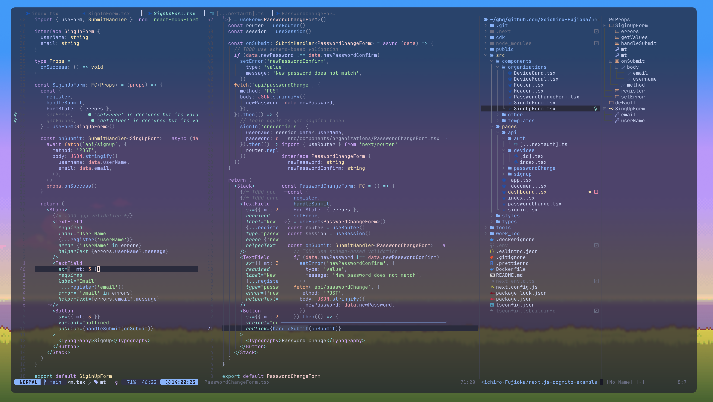

## Screen Shot

## Applications

- [neovim/neovim](https://github.com/neovim/neovim) - a project that seeks to aggressively refactor Vim
- [fish-shell/fish-shell](https://github.com/fish-shell/fish-shell) - the friendly interactive shell
- [jorgebucaran/fisher](https://github.com/jorgebucaran/fisher) - a plugin manager for Fish
  - [jethrokuan/z](https://github.com/jethrokuan/z) - a port of [z](https://github.com/rupa/z) for the fish shel
- [tmux/tmux](https://github.com/tmux/tmux) - a terminal multiplexer
- [wez/wezterm](https://github.com/wez/wezterm) - a GPU-accelerated cross-platform terminal emulator and multiplexer
- [ghostty-org/ghostty](https://github.com/ghostty-org/ghostty) - a fast, feature-rich, and cross-platform terminal emulator
- [alacritty/alacritty](https://github.com/alacritty/alacritty) - a cross-platform, GPU-accelerated terminal emulator
- [x-motemen/ghq](https://github.com/x-motemen/ghq) - manage remote repository clones
- [jdx/mise](https://github.com/jdx/mise) - a polyglot runtime and tool version manager
- [dandavison/git-delta](https://github.com/dandavison/delta) - a git diff tools
- [jesseduffield/lazygit](https://github.com/jesseduffield/lazygit) - a simple terminal UI for git commands
- [modem-dev/hunk](https://github.com/modem-dev/hunk) - a review-first terminal diff viewer for agentic coders
- [tree-sitter/tree-sitter](https://github.com/tree-sitter/tree-sitter) - a parser generator tool and an incremental parsing library
- [peco/peco](https://github.com/peco/peco) - simplistic interactive filtering tool

- [anthropics/claude-code](https://github.com/anthropics/claude-code) - an agentic coding tool that lives in your terminal
- [openai/codex](https://github.com/openai/codex) - a lightweight coding agent that runs in your terminal
- [sst/opencode](https://github.com/sst/opencode) - the AI coding agent built for the terminal

## How to setup

This neovim settings use [LazyVim](https://www.lazyvim.org). So when you start neovim, required plugins will be installed automatically.

1. Create `.config` and set alias at user directory
2. Happy Coding!!🍻
